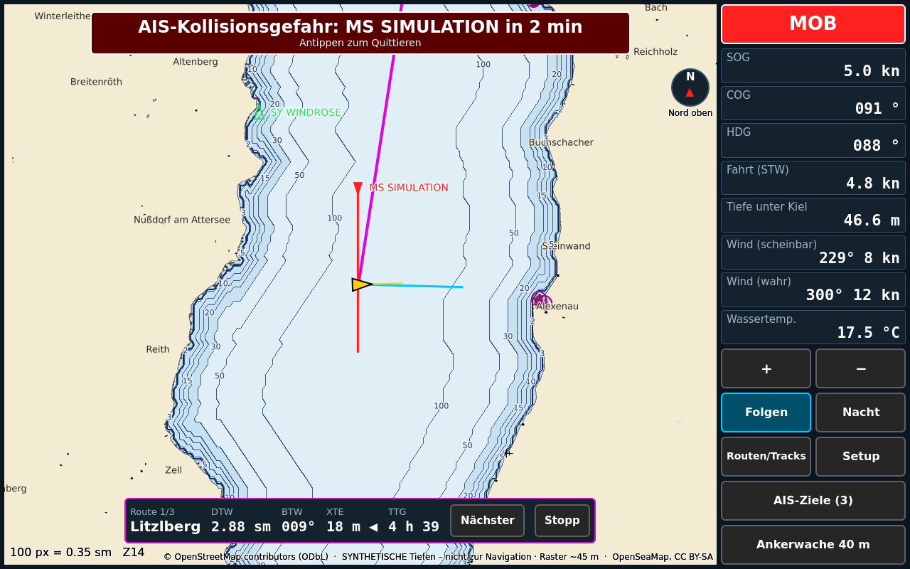
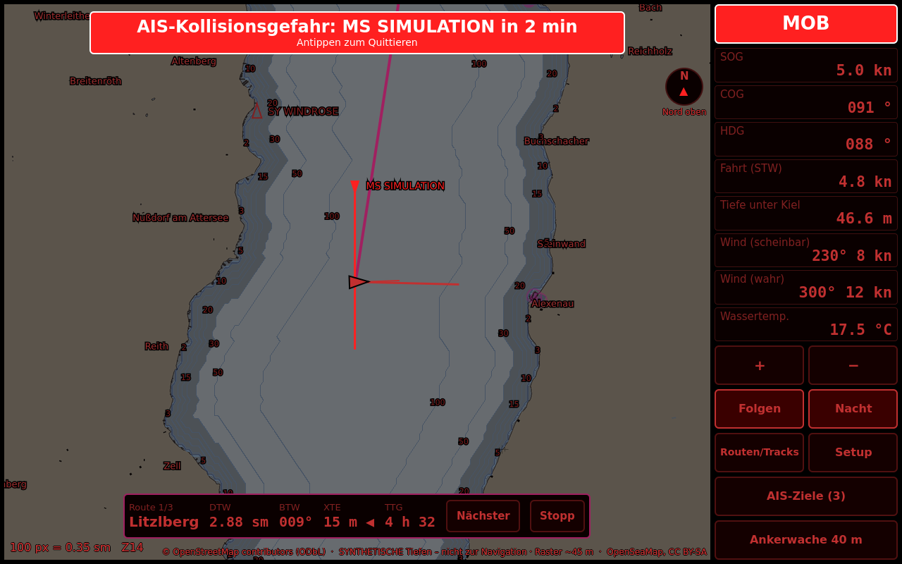
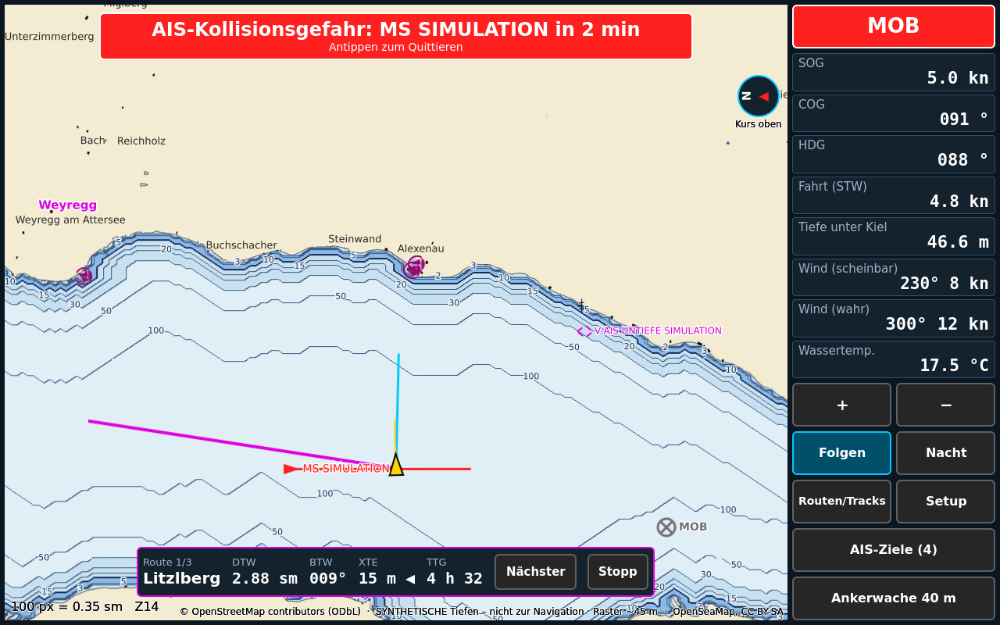
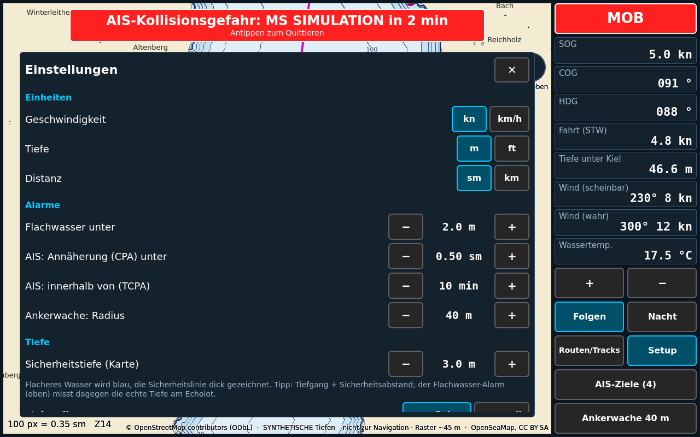

# OpenBoat

Modularer Open-Source-Kartenplotter / Multifunktionsdisplay für Boote –
funktional angelehnt an Geräte wie den Garmin GPSMAP 9000xsv. Schwesterprojekt von
[OpenEFIS](https://github.com/dansparker/open-efis), gleiche Architektur.

**C++20 · Qt 6 / QML · CMake · Raspberry Pi / Linux-SBC · NMEA 0183 · NMEA 2000**

> ⚠️ **Sicherheitshinweis:** Experimentell, **nicht zugelassen**, kein Ersatz für amtliche
> Seekarten, ECDIS oder ordentliche Seemannschaft. Die freien Karten können veraltet, lückenhaft
> oder falsch sein. Immer eine unabhängige Navigationsmöglichkeit an Bord haben.



<details><summary>Nachtmodus</summary>


</details>

<details><summary>Kurs oben</summary>


</details>

<details><summary>Einstellungen</summary>


</details>

Simulator mit Demo-Route (`--demo`), Grundkarte aus OpenStreetMap (`tools/make_basemap.py`), OpenSeaMap-Seezeichen und **synthetischen** Tiefenlinien (nur Demo, keine echten Tiefen des Attersees). Die Screenshots erzeugt die CI bei jedem Lauf (Artefakt „screenshots“).

## Vorbild und Stand

| GPSMAP 9000xsv | OpenBoat | Stand |
|---|---|---|
| Kartenplotter (BlueChart g3 / Navionics) | Rasterkarten aus MBTiles: **selbst gerenderte Grundkarte aus OpenStreetMap** (`tools/make_basemap.py`) + OpenSeaMap-Seezeichen, Eigenschiff, COG-Vektor, Kursstrich | ✅ v0.2 |
| GPS / Kompass / Log / Echolot / Wind | NMEA 0183 (UDP, TCP, seriell, Logdatei) und NMEA 2000 (SocketCAN, candump) | ✅ v0.1 (ungetestet an Hardware) |
| Datenleiste | SOG, COG, Steuerkurs, Fahrt durchs Wasser, Tiefe, scheinbarer/wahrer Wind, Wassertemperatur | ✅ v0.1 |
| AIS | Ziele aus AIVDM (Typ 1/2/3/5/18/19/24) und NMEA 2000 (129038/129039), CPA/TCPA, Kollisionswarnung | ✅ v0.1 |
| AIS-Zielliste | Notsender zuerst, dann Kollisionsgefahr, dann Distanz; Details (Rufzeichen, Typ, Maße, Status), „Auf Karte“, Ziel auf der Karte antippen | ✅ v0.2 |
| AIS-SART / MOB / EPIRB | Erkennung an der MMSI (970/972/974), eigenes Kartensymbol, Alarm unabhängig vom CPA; Testaussendungen (Status 15) ohne Alarm | ✅ v0.2 |
| Missweisung | Vom Gerät (RMC, HDG, PGN 127250/127258), sonst aus dem World Magnetic Model (WMM2025, mitgeliefert, gültig bis Ende 2029) | ✅ v0.2 |
| Alarme | Ankerwache, Flachwasser, AIS-Kollision, GNSS-Ausfall, Tiefenausfall; Quittierung; **Ton über Lautsprecher und GPIO-Summer** (Alarm: Dauerpiepen, Warnung: Doppelpiep), Summer-Selbsttest beim Start | ✅ v0.2 |
| Nachtmodus | Rote, abgedunkelte Darstellung | ✅ v0.1 |
| Simulator | Boot auf dem Attersee mit magnetischem Kompass, AIS-Zielen und MOB-Sender im Testmodus | ✅ v0.1 |
| Tiefenlinien | `tools/make_depth.py`: Tiefenlinien, Tiefenzahlen, Flachwasser-Schattierung aus EMODnet/GEBCO-Rastern oder S-57-Tiefenlinien (über GDAL); Sicherheitstiefe in der App einstellbar (dicke Sicherheitslinie, wirkt sofort) | ✅ v0.2 |
| Kurs oben / Nord oben | Kartendrehung mit Hysterese, Nordpfeil zum Umschalten; Ortsnamen und Tiefenzahlen bleiben aufrecht (abschaltbar) | ✅ v0.2 |
| Vektorkarten (S-57 / Inland ENC) | vollständige Darstellung nach S-52 | 🔜 [Roadmap](docs/roadmap.md) |
| Wegpunkte, Routen, Go-To, MOB | Wegpunkt per Langdruck auf die Karte, Routen-Editor, automatischer Wegpunktwechsel, XTE/BTW/DTW/TTG, Ankunftsalarm, MOB-Taste; Speicherung als GPX | ✅ v0.2 |
| Track | Aufzeichnung mit Sprungfilter (vor Anker keine Punktwolke), Tagesdateien nur durch Anhängen (stromausfallsicher), Zeit aus dem GNSS, GPX-Export, Anzeige auf der Karte, frühere Tage einblendbar | ✅ v0.2 |
| Einstellungen | Einheiten (kn/km/h, m/ft, sm/km), Alarmgrenzen, Anker-/Ankunftsradius, Kursvektor, Track, Tiefenoffset (vom Geber/manuell, Bezug wird angezeigt), Overzoom mit Warnhinweis; wirken sofort, atomar gespeichert | ✅ v0.2 |
| Autopilot-Anbindung | NMEA 0183 RMB/APB/XTE über UDP oder seriell (`autopilot_output`) | ✅ v0.2 (ungetestet am Autopiloten) |
| Echolot-Bild (CHIRP, ClearVü/SideVü) | Nur über offene Sonar-Hardware möglich, siehe [ADR 0004](docs/adr/0004-sonar-radar.md) | 🔬 Recherche |
| Radar | Nur Geräte mit offengelegtem/reverse-engineertem Protokoll | 🔬 Recherche |

## Architektur in einem Satz

Alle Module (Datenquellen, Simulator, Navigation/Alarme, UI) kommunizieren **ausschließlich
über einen typsicheren Datenbus** – jede Quelle ist austauschbar, ohne die Anzeige anzufassen.
Details: [docs/architecture.md](docs/architecture.md).

```
src/
├── core/            Qt-freier Kern: DataBus, Datentypen, Navigationsmathematik
├── hal/             UDP, TCP, seriell, SocketCAN, candump-Wiedergabe
├── modules/
│   ├── nmea0183/    Satz-Parser, AIS-Decoder, Datenquelle
│   ├── nmea2000/    PGN-Decoder, Fast-Packet, Datenquelle (nur Empfang)
│   ├── nav/         Wahrer Wind, AIS-Zieltabelle (CPA/TCPA), Alarme, Missweisung (WMM)
│   └── sim/         Simulator
└── app/             Qt/QML-Anwendung: Karte, Datenleiste, Alarme
tests/               GoogleTest-Unit-Tests
tools/               make_basemap.py (Grundkarte aus OSM), fetch_tiles.py (Overlays herunterladen)
config/              Beispielkonfiguration
docs/                Architektur, Karten, Hardware, Roadmap, ADRs
```

## Bauen

```bash
# Nur Kern + Tests (kein Qt nötig)
cmake --preset core-only && cmake --build --preset core-only && ctest --preset core-only

# Mit Anwendung (Qt ≥ 6.5 mit Quick und Sql)
cmake --preset release && cmake --build --preset release
./build/release/src/app/openboat --config config/boat.example.json
```

Ohne Karten startet die Anwendung mit dem Simulator auf leerem Hintergrund.
Karten besorgen: [docs/charts.md](docs/charts.md).

## Konfiguration

`config/boat.example.json` kopieren und anpassen: Datenquellen (`sources`), Karten
(`charts`, erste = Basiskarte, weitere = Overlays), Tiefenoffset und Alarmgrenzen.
Relative Pfade gelten relativ zur Konfigurationsdatei.

## Dokumentation

- [Architektur](docs/architecture.md)
- [Freie Karten: Quellen, Lizenzen, Grenzen](docs/charts.md)
- [Hardware-Vorschlag](docs/hardware.md)
- [Roadmap](docs/roadmap.md)
- ADRs: [0001 Tech-Stack](docs/adr/0001-tech-stack.md) ·
  [0002 NMEA 2000 nur Empfang](docs/adr/0002-nmea2000-listen-only.md) ·
  [0003 Karten](docs/adr/0003-charts.md) · [0004 Sonar/Radar](docs/adr/0004-sonar-radar.md)

## Lizenz

MIT – siehe [LICENSE](LICENSE). Kartendaten haben eigene Lizenzen (OpenStreetMap/OpenSeaMap:
ODbL bzw. CC BY-SA) und verlangen Namensnennung; die Anwendung blendet sie ein.
